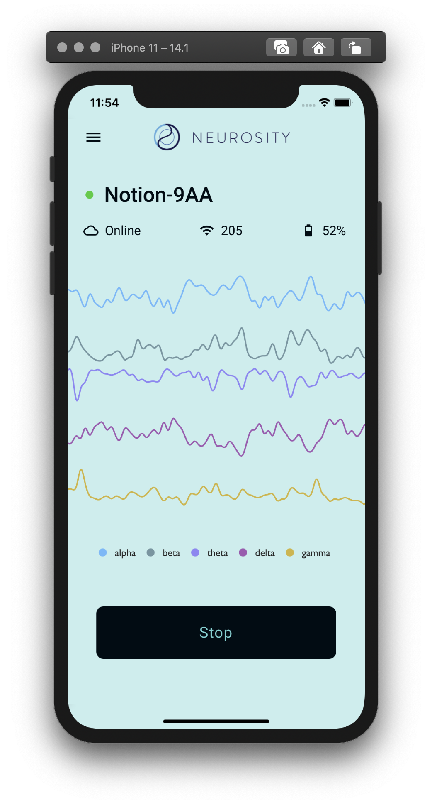

# 🚀 Notion React Native Starter



### Getting Started

- 1️⃣ `git clone https://github.com/neurosity/notion-react-native-starter.git`
- 2️⃣ `cd notion-react-native-starter`
- 3️⃣ `npm install`
- 4️⃣ `npm start`
- 5️⃣ `npx react-native run-ios (or npx react-native run-android)`

### Installing Pods

```
npx pod-install
```

### The Stack

- ⚛️ Built with React Native - [Create React Native App](https://reactnative.dev/)
- 🏆 React Navigation - [@react-navigation/native](https://reactnavigation.org/)
- 🤯 NotionJS API - [@neurosity/notion](https://github.com/neurosity/notion-js)
- 🔑 NotionJS Authentication - [Notion Docs](http://docs.neurosity.co/)
- 👍 React Use - [react-use](https://github.com/streamich/react-use)

### Features

- Brainwaves Power Time Series
- Device Status (connection, wifi, battery, etc)
- Multi-device support
- Sleep mode detection
